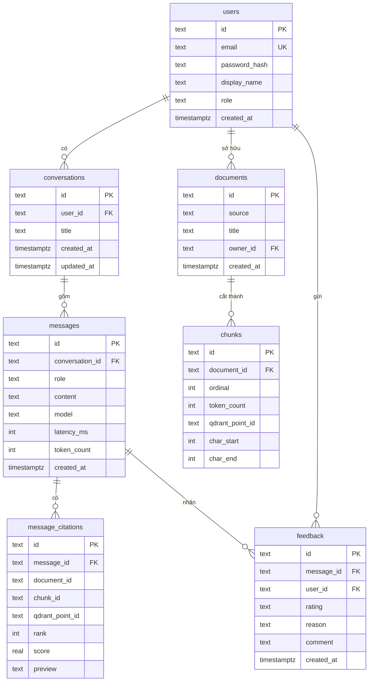
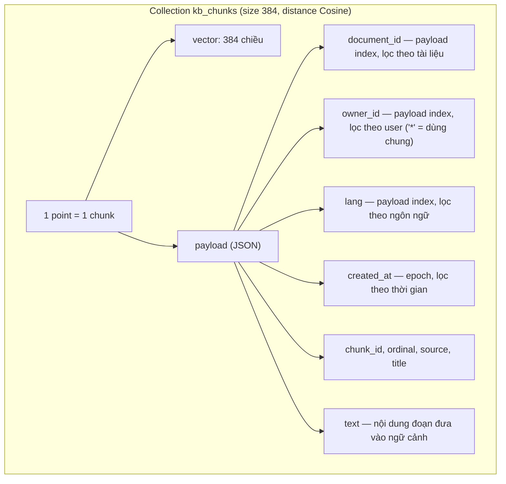
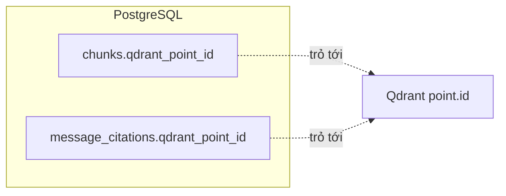

# Thiết kế database — RAG Chatbot

Sơ đồ Mermaid (preview bằng VS Code hoặc GitHub).

## 1. PostgreSQL — nguồn sự thật (quan hệ)

**Ghi chú thiết kế**
- `feedback`: UNIQUE(message_id, user_id) — mỗi người chỉ 1 đánh giá cho mỗi câu trả lời.
- `documents.owner_id`: cho phép NULL = tài liệu dùng chung (ON DELETE SET NULL).
- Mọi FK đều ON DELETE CASCADE (xoá user → xoá hội thoại → xoá tin nhắn → xoá citations/feedback).
- Liên kết mềm (không phải FK, dùng để JOIN/trỏ chéo): `message_citations.document_id → documents.id`, `message_citations.chunk_id → chunks.id`.
- `chunks.qdrant_point_id`, `message_citations.qdrant_point_id` trỏ sang point bên Qdrant.

## 2. Qdrant — vector store

**Ghi chú thiết kế**
- Số chiều vector (384) gắn với model embedding `paraphrase-multilingual-MiniLM-L12-v2`; đổi model là phải tạo lại collection + nạp lại.
- Payload mang các trường **lọc được** (có payload index): `document_id`, `owner_id`, `lang` → search giới hạn được phạm vi. Đây là điểm khác biệt: vector DB không chỉ lưu text.
- `text` nằm trong payload để ghép thẳng vào ngữ cảnh, khỏi quay lại Postgres.

## 3. Cầu nối Postgres ↔ Qdrant

Postgres giữ metadata + quan hệ; Qdrant giữ vector + đoạn text. `qdrant_point_id` là khóa nối hai bên: từ một citation/chunk trong Postgres tìm đúng point trong Qdrant và ngược lại.
